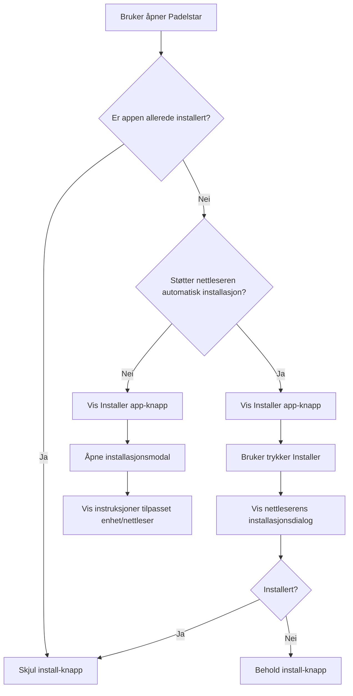

# Padelstar – Implementering av installasjon som webapp/PWA

Sist oppdatert: 2026-09-02
Status: Implementert i fase 1 (grunnflyt)
Formål: Gjøre det enkelt for brukere å installere Padelstar som en app på mobil, nettbrett og desktop.

---

# 1. Mål

Padelstar skal kunne installeres som en **Progressive Web App (PWA)** på støttede plattformer.

Brukeren skal kunne:

- installere Padelstar på Windows
- installere Padelstar på macOS
- legge Padelstar på hjemskjermen på iPhone/iPad
- installere Padelstar på Android
- installere Padelstar på Chromebook
- åpne Padelstar i et eget app-vindu uten vanlig nettlesergrensesnitt der plattformen støtter dette
- få riktig installasjonsveiledning automatisk ut fra enhet og nettleser

Implementasjonen skal ha god fallback dersom nettleseren ikke støtter automatisk PWA-installasjon.

---

# 2. Overordnet løsning

Implementasjonen består av fem deler:

1. **Web App Manifest**
2. **Service Worker**
3. **Install-knapp i brukergrensesnittet**
4. **Deteksjon av plattform og installasjonsstatus**
5. **Fallback-modal med manuelle installasjonsinstruksjoner**

Foreslått flyt:



---

# 3. Web App Manifest

Opprett følgende fil:

```text
/manifest.webmanifest
```

Eksempel:

```json
{
  "name": "Padelstar",
  "short_name": "Padelstar",
  "description": "Turneringsverktøy for padel",
  "start_url": "./",
  "scope": "./",
  "display": "standalone",
  "background_color": "#07111f",
  "theme_color": "#0b1f35",
  "orientation": "any",
  "icons": [
    {
      "src": "assets/icons/padelstar-192.png",
      "sizes": "192x192",
      "type": "image/png"
    },
    {
      "src": "assets/icons/padelstar-512.png",
      "sizes": "512x512",
      "type": "image/png"
    },
    {
      "src": "assets/icons/padelstar-maskable-512.png",
      "sizes": "512x512",
      "type": "image/png",
      "purpose": "maskable"
    }
  ]
}
```

## Krav til ikoner

Minimum:

```text
assets/icons/padelstar-192.png
assets/icons/padelstar-512.png
assets/icons/padelstar-maskable-512.png
```

Anbefalt i tillegg:

```text
assets/icons/apple-touch-icon.png
assets/icons/favicon-32.png
assets/icons/favicon-16.png
```

Logoikonet bør ha god luft rundt selve Padelstar-merket slik at Android ikke kutter grafikken når maskable icons brukes.

---

# 4. Koble manifestet til HTML

Legg dette inn i `<head>` i hovedfilen:

```html
<link rel="manifest" href="manifest.webmanifest">

<meta name="theme-color" content="#0b1f35">

<link
  rel="apple-touch-icon"
  href="assets/icons/apple-touch-icon.png"
>

<meta name="apple-mobile-web-app-capable" content="yes">

<meta
  name="apple-mobile-web-app-status-bar-style"
  content="black-translucent"
>

<meta
  name="apple-mobile-web-app-title"
  content="Padelstar"
>
```

Dette sørger blant annet for riktig appnavn, ikon og statuslinje på mobile enheter.

---

# 5. Service Worker

Opprett:

```text
/service-worker.js
```

Første versjon kan være enkel.

Eksempel:

```javascript
const CACHE_NAME = "padelstar-v1";

const APP_SHELL = [
  "./",
  "./index.html",
  "./styles.css",
  "./script.js",
  "./manifest.webmanifest"
];

self.addEventListener("install", (event) => {
  event.waitUntil(
    caches.open(CACHE_NAME).then((cache) => {
      return cache.addAll(APP_SHELL);
    })
  );
});

self.addEventListener("activate", (event) => {
  event.waitUntil(
    caches.keys().then((keys) => {
      return Promise.all(
        keys
          .filter((key) => key !== CACHE_NAME)
          .map((key) => caches.delete(key))
      );
    })
  );
});

self.addEventListener("fetch", (event) => {
  if (event.request.method !== "GET") {
    return;
  }

  event.respondWith(
    fetch(event.request).catch(() => {
      return caches.match(event.request);
    })
  );
});
```

---

# 6. Registrere Service Worker

Legg følgende inn i hoved-JavaScript-filen:

```javascript
if ("serviceWorker" in navigator) {
  window.addEventListener("load", () => {
    navigator.serviceWorker
      .register("./service-worker.js")
      .catch((error) => {
        console.error("Service worker registration failed:", error);
      });
  });
}
```

---

# 7. Installer-knapp i brukergrensesnittet

Legg til en knapp et naturlig sted i UI-et.

Foreslått plassering:

- settings / meny
- landing page
- brukerprofil
- egen installasjonsseksjon

Eksempel:

```html
<button
  id="install-app-button"
  class="button button-secondary"
  type="button"
  hidden
>
  📲 Installer Padelstar
</button>
```

Knappen skal ikke nødvendigvis være synlig hele tiden.

---

# 8. Automatisk PWA-installasjon

Chrome, Edge og flere Chromium-baserte nettlesere støtter eventen:

```javascript
beforeinstallprompt
```

Opprett en global variabel:

```javascript
let deferredInstallPrompt = null;
```

Lytt etter installasjonshendelsen:

```javascript
window.addEventListener("beforeinstallprompt", (event) => {
  event.preventDefault();

  deferredInstallPrompt = event;

  showInstallButton();
});
```

Install-knappen:

```javascript
const installButton =
  document.getElementById("install-app-button");

installButton.addEventListener("click", async () => {
  if (deferredInstallPrompt) {
    deferredInstallPrompt.prompt();

    const result =
      await deferredInstallPrompt.userChoice;

    if (result.outcome === "accepted") {
      hideInstallButton();
    }

    deferredInstallPrompt = null;

    return;
  }

  openInstallInstructions();
});
```

---

# 9. Registrere at appen er installert

Lytt etter:

```javascript
window.addEventListener("appinstalled", () => {
  deferredInstallPrompt = null;

  hideInstallButton();

  console.log("Padelstar installed");
});
```

---

# 10. Sjekke om appen allerede kjører som installert app

Opprett:

```javascript
function isStandaloneMode() {
  return (
    window.matchMedia(
      "(display-mode: standalone)"
    ).matches ||
    window.navigator.standalone === true
  );
}
```

Ved oppstart:

```javascript
if (isStandaloneMode()) {
  hideInstallButton();
}
```

På iOS brukes:

```javascript
window.navigator.standalone
```

mens vanlige PWA-nettlesere bruker:

```css
display-mode: standalone
```

---

# 11. Plattformdeteksjon

Det bør ikke bygges kritisk funksjonalitet kun på user-agent-detektering.

Den kan likevel brukes for å vise riktige instruksjoner.

Opprett eksempelvis:

```javascript
function getPlatform() {
  const ua = navigator.userAgent.toLowerCase();

  if (/iphone|ipad|ipod/.test(ua)) {
    return "ios";
  }

  if (/android/.test(ua)) {
    return "android";
  }

  if (/windows/.test(ua)) {
    return "windows";
  }

  if (/macintosh|mac os x/.test(ua)) {
    return "macos";
  }

  if (/cros/.test(ua)) {
    return "chromeos";
  }

  return "unknown";
}
```

---

# 12. Nettleserdeteksjon

For installasjonsveiledningen kan følgende kategorier være nyttige:

```javascript
function getBrowser() {
  const ua = navigator.userAgent.toLowerCase();

  if (ua.includes("edg/")) {
    return "edge";
  }

  if (
    ua.includes("chrome/") &&
    !ua.includes("edg/")
  ) {
    return "chrome";
  }

  if (
    ua.includes("safari/") &&
    !ua.includes("chrome/")
  ) {
    return "safari";
  }

  if (ua.includes("firefox/")) {
    return "firefox";
  }

  return "other";
}
```

Bruk dette kun til presentasjon av riktig hjelpeinnhold.

---

# 13. Installasjonsmodal

Dersom automatisk installasjon ikke er tilgjengelig, skal install-knappen åpne en modal.

Eksempel:

```html
<div
  id="install-modal"
  class="modal"
  hidden
>
  <div class="modal-card">

    <button
      id="install-modal-close"
      class="modal-close"
      type="button"
      aria-label="Lukk"
    >
      ×
    </button>

    <h2>Installer Padelstar</h2>

    <div id="install-instructions"></div>

  </div>
</div>
```

---

# 14. Dynamiske installasjonsinstruksjoner

Opprett instruksjoner per plattform.

Eksempel:

```javascript
const installInstructions = {
  ios: `
    <h3>iPhone / iPad</h3>
    <ol>
      <li>Åpne Padelstar i Safari.</li>
      <li>Trykk på Del-knappen.</li>
      <li>Velg «Legg til på Hjem-skjerm».</li>
      <li>Trykk «Legg til».</li>
    </ol>
  `,

  android: `
    <h3>Android</h3>
    <ol>
      <li>Åpne Padelstar i Chrome.</li>
      <li>Trykk menyknappen ⋮.</li>
      <li>Velg «Installer app» eller «Legg til på startskjermen».</li>
      <li>Bekreft installasjonen.</li>
    </ol>
  `,

  windows: `
    <h3>Windows</h3>
    <ol>
      <li>Åpne Padelstar i Edge eller Chrome.</li>
      <li>Åpne nettlesermenyen.</li>
      <li>Velg installer app/nettsted som app.</li>
      <li>Bekreft installasjonen.</li>
    </ol>
  `,

  macos: `
    <h3>Mac</h3>
    <ol>
      <li>Åpne Padelstar i Safari.</li>
      <li>Velg Del.</li>
      <li>Velg «Legg til i Dock».</li>
      <li>Bekreft.</li>
    </ol>
  `,

  chromeos: `
    <h3>Chromebook</h3>
    <ol>
      <li>Åpne Padelstar i Chrome.</li>
      <li>Åpne menyen ⋮.</li>
      <li>Velg «Installer app».</li>
      <li>Bekreft.</li>
    </ol>
  `
};
```

---

# 15. Åpne riktig installasjonsveiledning

```javascript
function openInstallInstructions() {
  const platform = getPlatform();

  const modal =
    document.getElementById("install-modal");

  const content =
    document.getElementById("install-instructions");

  content.innerHTML =
    installInstructions[platform] ||
    getGenericInstallInstructions();

  modal.hidden = false;
}
```

Fallback:

```javascript
function getGenericInstallInstructions() {
  return `
    <h3>Installer Padelstar</h3>

    <p>
      Åpne nettlesermenyen og se etter
      «Installer app»,
      «Legg til på startskjermen»
      eller tilsvarende alternativ.
    </p>
  `;
}
```

---

# 16. Spesiell håndtering av iPhone og iPad

Safari på iOS bør behandles som et eget tilfelle.

Dersom:

```javascript
platform === "ios"
```

og Padelstar ikke allerede kjører i standalone mode, skal install-knappen være tilgjengelig selv om:

```javascript
beforeinstallprompt
```

aldri blir trigget.

Eksempel:

```javascript
function shouldShowManualInstallButton() {
  const platform = getPlatform();

  if (isStandaloneMode()) {
    return false;
  }

  return platform === "ios";
}
```

---

# 17. Installer-knappens synlighet

Foreslått logikk:

```javascript
function updateInstallButtonVisibility() {
  if (isStandaloneMode()) {
    hideInstallButton();
    return;
  }

  const platform = getPlatform();

  if (
    deferredInstallPrompt ||
    platform === "ios" ||
    platform === "macos"
  ) {
    showInstallButton();
  }
}
```

---

# 18. UI-funksjoner

```javascript
function showInstallButton() {
  const button =
    document.getElementById("install-app-button");

  if (button) {
    button.hidden = false;
  }
}

function hideInstallButton() {
  const button =
    document.getElementById("install-app-button");

  if (button) {
    button.hidden = true;
  }
}
```

---

# 19. Anbefalt brukeropplevelse i Padelstar

## Ikke installer automatisk

Appen skal aldri åpne installasjonsdialogen automatisk.

Brukeren skal selv trykke:

```text
📲 Installer Padelstar
```

Dette gir mindre friksjon og unngår at installasjonsdialoger oppfattes som reklame eller spam.

---

# 20. Forslag til installasjonskort

På landing page kan et lite kort vises:

```text
📲 Installer Padelstar

Legg Padelstar på hjemskjermen eller skrivebordet
og åpne den som en vanlig app.

[ Installer app ]
```

Kortet skal være sekundært i forhold til hovedhandlingene:

```text
Create tournament
Join tournament
```

Det skal derfor ikke dominere landing page.

---

# 21. Alternativ plassering

Installer-knappen kan også legges i appens hovedmeny:

```text
Turnering
Spiller
Innstillinger
Installer Padelstar
```

Dette er sannsynligvis den beste permanente plasseringen.

På landing page kan installasjonen eventuelt markedsføres mer diskret.

---

# 22. Styling

Installer-knappen skal bruke Padelstars eksisterende designsystem.

Eksempel:

```css
.install-app-button {
  display: inline-flex;
  align-items: center;
  justify-content: center;
  gap: 0.5rem;

  min-height: 44px;

  border-radius: 12px;
  border: 1px solid var(--line);

  background: var(--surface);
  color: var(--ink);

  font: inherit;
  cursor: pointer;
}
```

Hover:

```css
.install-app-button:hover {
  filter: brightness(1.08);
}
```

---

# 23. Modal-layout på mobil

Modalen bør bruke nesten hele skjermbredden:

```css
.install-modal-card {
  width: min(92vw, 520px);
  max-height: 85vh;
  overflow-y: auto;
}
```

Instruksjonene bør bruke store nok trykkflater og god linjeavstand.

---

# 24. Installert app skal ikke vise installasjonstilbud

Når Padelstar kjører som installert app:

```javascript
isStandaloneMode() === true
```

skal følgende skjules:

- installasjonskort
- installer-knapp
- installer-banner
- installasjonsveiledning

---

# 25. Oppdatering av Service Worker

Ved nye releases må cache-versjonen kunne økes.

Eksempel:

```javascript
const CACHE_NAME = "padelstar-v2";
```

Gamle cacher fjernes i:

```javascript
activate
```

Dette hindrer at brukeren sitter fast på gamle HTML-, CSS- eller JS-filer.

---

# 26. Viktig for GitHub Pages

Padelstar kjører på GitHub Pages.

Pass derfor på at alle stier fungerer relativt til repository path.

Foretrekk:

```text
./styles.css
./script.js
./manifest.webmanifest
./assets/...
```

framfor:

```text
/styles.css
/script.js
/manifest.webmanifest
```

dersom appen ligger på:

```text
https://zigonia-it.github.io/Padel_manager_web/
```

En absolutt sti som:

```text
/manifest.webmanifest
```

vil ellers peke mot roten av:

```text
zigonia-it.github.io
```

og ikke nødvendigvis mot Padelstar-repositoryet.

---

# 27. Manifest start_url på GitHub Pages

Ved GitHub Pages bør følgende vurderes:

```json
{
  "start_url": "./",
  "scope": "./"
}
```

Dette er tryggere enn:

```json
{
  "start_url": "/"
}
```

når appen publiseres fra et repository-subpath.

---

# 28. HTTPS-krav

PWA-funksjonalitet og Service Workers krever HTTPS i produksjon.

GitHub Pages leverer allerede nettstedet via HTTPS.

Lokalt fungerer Service Workers også på:

```text
localhost
```

---

# 29. Ikke cache Supabase-data ukritisk

Padelstar bruker Supabase.

Service Worker skal i første omgang primært cache statiske filer:

- HTML
- CSS
- JavaScript
- ikoner
- logoer
- lokale fonter

Supabase API-kall skal ikke ukritisk caches.

Turneringsdata skal fortsatt komme fra Supabase som normalt.

---

# 30. Offline-støtte

Første PWA-versjon trenger ikke ha full offline turneringsfunksjonalitet.

Minimumsmål:

```text
Padelstar kan starte dersom brukerens enhet midlertidig mangler nett,
men aktive turneringsdata krever nettforbindelse.
```

Senere kan en egen offline-strategi vurderes.

---

# 31. Feilhåndtering

Hvis Supabase ikke kan nås:

Vis tydelig melding:

```text
Ingen nettforbindelse

Padelstar er åpnet, men turneringsdata kan ikke synkroniseres akkurat nå.

Prøv igjen når du har nettforbindelse.
```

Ikke la appen se ut som om data er synkronisert dersom den faktisk er offline.

---

# 32. Accessibility

Installer-funksjonaliteten skal følge samme accessibility-krav som resten av appen.

Minimum:

- `aria-label` på ikonknapper
- tastaturnavigasjon
- Escape lukker modal
- fokus flyttes til modal når den åpnes
- fokus returneres til install-knappen når modal lukkes
- minimum 44 × 44 px trykkflate på mobile enheter
- tekstinstruksjoner skal ikke være avhengige av farger alene

---

# 33. Foreslått filstruktur

```text
Padel_manager_web/
│
├── index.html
├── styles.css
├── script.js
│
├── manifest.webmanifest
├── service-worker.js
│
└── assets/
    └── icons/
        ├── padelstar-192.png
        ├── padelstar-512.png
        ├── padelstar-maskable-512.png
        ├── apple-touch-icon.png
        ├── favicon-32.png
        └── favicon-16.png
```

Hvis eksisterende prosjekt allerede har modulær JavaScript-struktur kan installasjonslogikken i stedet flyttes til:

```text
/js/pwa.js
```

---

# 34. Foreslått modul

Eksempel:

```text
js/
├── app.js
├── tournament.js
├── ui.js
└── pwa.js
```

`pwa.js` får ansvar for:

```text
- service worker registration
- beforeinstallprompt
- appinstalled
- standalone detection
- platform detection
- install modal
- install button visibility
```

---

# 35. API for resten av appen

Eksporter gjerne:

```javascript
export {
  initPWA,
  openInstallInstructions,
  isStandaloneMode
};
```

Hovedappen starter så funksjonaliteten med:

```javascript
import { initPWA } from "./pwa.js";

initPWA();
```

---

# 36. Testmatrise

Implementasjonen skal minimum testes på:

| Plattform | Nettleser | Forventet resultat |
|---|---|---|
| Windows 11 | Edge | Automatisk installasjonsdialog |
| Windows 11 | Chrome | Automatisk installasjonsdialog |
| macOS | Safari | Instruksjon / Legg til i Dock |
| macOS | Chrome | PWA-installasjon |
| iPhone | Safari | Legg til på Hjem-skjerm |
| iPad | Safari | Legg til på Hjem-skjerm |
| Android | Chrome | Installer app |
| Chromebook | Chrome | Installer app |

---

# 37. Testscenarier

## Scenario 1 – førstegangsbesøk

```text
GIVEN
brukeren åpner Padelstar i Chrome

AND
appen ikke er installert

WHEN
beforeinstallprompt blir tilgjengelig

THEN
skal Installer Padelstar-knappen vises
```

---

## Scenario 2 – installasjon

```text
WHEN
brukeren trykker Installer Padelstar

THEN
skal nettleserens native installasjonsdialog åpnes
```

---

## Scenario 3 – allerede installert

```text
GIVEN
Padelstar kjører i standalone-mode

THEN
skal installasjonsknappen ikke vises
```

---

## Scenario 4 – iPhone

```text
GIVEN
brukeren åpner Padelstar på iPhone

AND
appen ikke kjører i standalone-mode

THEN
skal Installer Padelstar-knappen vises

WHEN
brukeren trykker knappen

THEN
skal iOS-instruksjonene vises
```

---

## Scenario 5 – bruker avviser installasjon

```text
GIVEN
brukeren åpner nettleserens installasjonsdialog

WHEN
brukeren avviser installasjonen

THEN
skal appen fortsette å fungere normalt
```

---

# 38. Akseptansekriterier

Implementasjonen regnes som ferdig når:

- [ ] `manifest.webmanifest` finnes og lastes uten feil
- [ ] appikon vises korrekt ved installasjon
- [ ] Service Worker registreres uten konsollfeil
- [ ] Padelstar kan installeres fra Chrome/Edge
- [ ] Padelstar kan åpnes i standalone mode
- [ ] install-knappen skjules når appen allerede er installert
- [ ] iPhone/iPad får egne installasjonsinstruksjoner
- [ ] macOS Safari får riktig installasjonsveiledning
- [ ] Android får riktig installasjonsflyt
- [ ] Windows får riktig installasjonsflyt
- [ ] installasjonsmodal fungerer på mobil og desktop
- [ ] Supabase-funksjonalitet fortsetter å fungere
- [ ] GitHub Pages-paths fungerer korrekt
- [ ] eksisterende turneringslogikk påvirkes ikke
- [ ] installasjon er valgfritt og blokkerer aldri bruk av appen

---

# 39. Prioritert implementeringsrekkefølge

## Fase 1 – PWA-grunnlag

1. Opprett appikoner
2. Opprett `manifest.webmanifest`
3. Link manifestet i HTML
4. Opprett Service Worker
5. Registrer Service Worker
6. Verifiser at manifest og Service Worker fungerer på GitHub Pages

---

## Fase 2 – automatisk installasjon

1. Implementer `beforeinstallprompt`
2. Lag installer-knapp
3. Implementer install-click handler
4. Implementer `appinstalled`
5. Implementer standalone detection

---

## Fase 3 – Apple og fallback

1. Detekter iOS/iPadOS
2. Detekter macOS
3. Opprett installasjonsmodal
4. Opprett plattformspesifikke instruksjoner
5. Vis modal dersom native install prompt ikke finnes

---

## Fase 4 – UX

1. Integrer install-knappen med Padelstar-design
2. Legg installer-valget i meny/settings
3. Eventuelt legg diskret installasjonskort på landing page
4. Implementer accessibility
5. Test på mobil og desktop

---

# 40. Ønsket sluttresultat

Brukeren skal oppleve følgende:

```text
Padelstar
↓
Installer Padelstar
↓
Operativsystemet/nettleseren velger beste installasjonsmetode
↓
Padelstar får eget ikon
↓
Padelstar åpnes som en app
```

Brukeren skal ikke behøve å forstå hva en PWA er.

Fra brukerens perspektiv skal funksjonen bare hete:

```text
Installer Padelstar
```

og oppføre seg som en vanlig appinstallasjon så langt plattformen tillater det.
