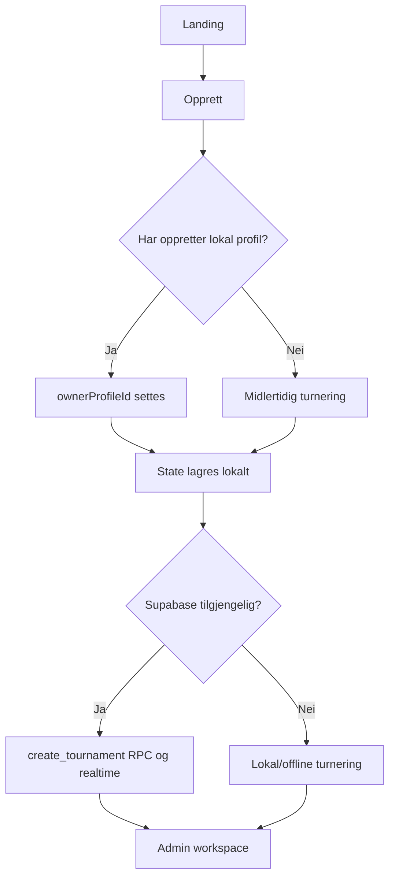

# Padelstar – app-flow

Sist oppdatert: 2026-09-04

Dette dokumentet beskriver den faktiske brukerflyten i Padelstar slik den er implementert i frontend og Supabase-integrasjonen. Appen er en statisk PWA: nettleseren eier UI og lokal state, mens Supabase er valgfritt for delt live-state.

## 1. Inngang og routing

`index.html` laster app-shell, moduler, CSS, oversettelser og `app/app.js`. Ved oppstart:

1. `state-bootstrap.js` leser aktiv turnering fra localStorage og forsøker recovery-kopi hvis state er ugyldig.
2. `i18n-ui.js` velger manuelt lagret språk, enhetens språk eller Bokmål som fallback.
3. `initial-view.js` tolker URL-parametere:
   - `?join=...` eller `?code=...` åpner Bli med.
   - `?spectate=...` åpner offentlig tilskuerflyt.
   - lagret admin-/spillerstate gjenopptas i riktig workspace.
4. `workspace-navigation.js` viser én aktiv modul og skjuler moduler som rollen ikke har tilgang til.

Hovedmoduler:

| Modul | Formål |
|---|---|
| Landing | Startside, gjenoppta turnering, Opprett, Bli med og Profil |
| setup-admin | Opprette turnering |
| setup-player | Bli med med invitasjonskode |
| account | Lokal spillerprofil og valgfri Supabase-konto |
| admin | Styre turnering, spillere, baner, runder, kamper og deling |
| player | Spillerens neste kamp, status, tilgjengelighet og resultat |
| tournament | Offentlig read-only oversikt / TV Mode |

## 2. Opprette turnering

Oppretter kan delta som spiller. Hvis dette velges og det finnes profil, kobles admin-spilleren til profilen. E-postkonto/innlogging er ikke nødvendig for å opprette en lokal eller midlertidig turnering. Supabase Auth kan fortsatt brukes for konto, admin-identitet og synkronisering.

Turneringsstate bygges i `tournament-state.js` og inneholder blant annet format, regler, baner, spillere, kamper, tokens, `ownerProfileId` og `retentionExpiresAt`.

## 3. Bli med

1. Brukeren åpner Bli med, eventuelt via join-lenke eller QR-kode.
2. Invitasjonskoden normaliseres til store bokstaver.
3. Appen sjekker lokal turnering eller henter remote state via invitasjons-RPC.
4. Spilleren skriver navn. Avatar tildeles automatisk.
5. Har brukeren lokal profil, kobles spilleren til `profileId`.
6. Uten profil blir spilleren gjest og kan delta uten at profil opprettes automatisk.
7. Ved Supabase-join utstedes spillertoken. Ved lokal/offline join brukes lokal state.
8. Brukeren sendes til spillerworkspace.

En spillerprofil er derfor valgfri for deltakelse, men nødvendig for at spillerens statistikk skal kunne beholdes som profilhistorikk.

## 4. Admin-flyt

Admin workspace består av styring, deling, spillere og kamper.

- Styring: start runde, fullfør runde og åpne regler.
- Del: invitasjonskode, join-lenke, QR og TV-/tilskuerlenke.
- Spillere: legg til, endre, fjern eller marker tilgjengelighet.
- Kamper: før resultat, walkover, avbryt og undo der dette støttes.
- Innstillinger: round-robin/cup, lagoppsett, baner, games per sett, sets per seier og poengmodus.

Alle admin-endringer går gjennom `saveState()`. State lagres først lokalt og sendes deretter til Supabase med debounce, revisjonskontroll og konflikt-/retry-håndtering når live sync er aktiv.

## 5. Spiller- og scoring-flyt

Spilleren ser egen status, neste kamp, makker, motspillere og resultater. Spillerstyrt scoring mot Supabase krever serverutstedt spillertoken. Lokalt/offline brukes lokal scoring og køesynkronisering når forbindelsen kommer tilbake.

Resultatflyten er:

`kamp → sett/games → validering → ferdig kamp → rundestatus → leaderboard → neste kamp`

Konflikter mellom samtidige resultater vises som konflikt og må eksplisitt løses. Appen skal ikke overskrive et nyere remote-resultat ukritisk.

## 6. Offentlig turnering og TV Mode

TV Mode bruker `tv.html` og en read-only spectator-URL. Den viser live kamper, status, resultater og oversikt uten spillerens personlige kontrollflate. Spectator-state hentes via whitelisted spectator-RPC når turneringen ikke allerede finnes lokalt.

Tilskuer kan forlate visningen uten å endre turneringen. En spiller kan forlate sin lokale spillerøkt; dette fjerner lokal identitet/token, ikke spilleren eller turneringsdata for andre.

## 7. Profil, konto og statistikk

Profil og konto er separate konsepter:

- Lokal profil: navn, avatar, profil-ID og lokal historikk.
- Supabase-konto: valgfri e-post/passord/Auth-identitet og eventuell remote profil.
- Profilert oppretter: `ownerProfileId` avgjør om turneringen kan beholdes permanent.
- Profilert spiller: spillerens `profileId` avgjør om statistikk og historikk kan beholdes.

Når turneringen avsluttes, opprettes profilhistorikk for den aktive profilen på enheten. Når en remote deltaker mottar overgangen til `Avsluttet`, forsøker appen også å lagre historikk for sin lokale profil. Spillere uten profil og gjestedata tas ut av avsluttet delt state.

## 8. Avslutning og retensjon

1. Admin bekrefter avslutning.
2. Uferdige kamper markeres som avbrutt.
3. Profilhistorikk lagres for profilerte spillere som kan identifiseres på enheten.
4. Ended-state sanitiseres: gjester, gjestekamper, tokens og transiente audit-/submission-data fjernes.
5. Har state ingen `ownerProfileId`, fjernes den lokale turneringskopien etter avslutning.
6. Remote midlertidige turneringer uten `owner_profile_id` får serverstyrt utløp innen 7 dager.
7. Remote turneringer med profilert oppretter kan beholdes. Cleanup-jobben er ikke offentlig tilgjengelig.

Dette betyr at en profilert spiller kan få sin egen statistikk selv om oppretteren ikke har profil, men selve turneringen blir likevel ikke permanent beholdt uten profilert oppretter.

## 9. Feil- og offlineflyt

- Manglende Supabase-klient: appen viser lokal/offline-flyt i stedet for å late som live sync er aktiv.
- Login uten tilgjengelig klient: konto-siden viser synlig feilmelding.
- Feil passord eller Auth-feil: submit-knapp låses kort under request, deretter vises feilstatus.
- Remote save-feil: lokal state beholdes, sync-feil registreres og retry forsøkes ved transient feil.
- Konflikt: bruker får valg mellom å hente remote state eller beholde lokal backup.
- Ugyldig localStorage: siste gode recovery-state brukes hvis mulig.
- Offline: localStorage er primær fallback, med recovery-kopi og IndexedDB-speiling der støttet.

## 10. Kildekart

- Routing og synlighet: `app/initial-view.js`, `app/module-routing.js`, `app/workspace-navigation.js`
- Opprett/join: `app/tournament-entry.js`, `app/remote-tournament.js`
- State og persistence: `app/tournament-state.js`, `app/state-bootstrap.js`, `app/app.js`, `app/storage.js`
- Roller: `app/session-policy.js`
- Auth/profil: `app/account-auth.js`, `app/profile-session.js`
- Scoring/turneringslogikk: `app/scoring-engine.js`, `app/tournament-engine.js`, `app/tournament-runtime.js`
- Retensjon: `app/retention-policy.js`, `supabase/migrations/20260904090000_profile_owned_tournament_retention.sql`, `docs/data_retention.md`
- Visuell og interaktiv QA: `scripts/browser-smoke.sh`, `test/`

## 11. Viktige avklaringer

- `ownerUserId` er Auth-eierskap; `ownerProfileId` er produktets profilbaserte lagringsregel.
- Lokal profil opprettes ikke automatisk bare fordi en bruker blir med som spiller.
- En lokal/offline turnering er ikke det samme som en permanent lagret turnering.
- Browser-smoke med blokkert ekstern backend verifiserer lokal UI og flyt, men ikke faktisk Supabase Auth, RPC eller realtime mot produksjonsprosjektet.
